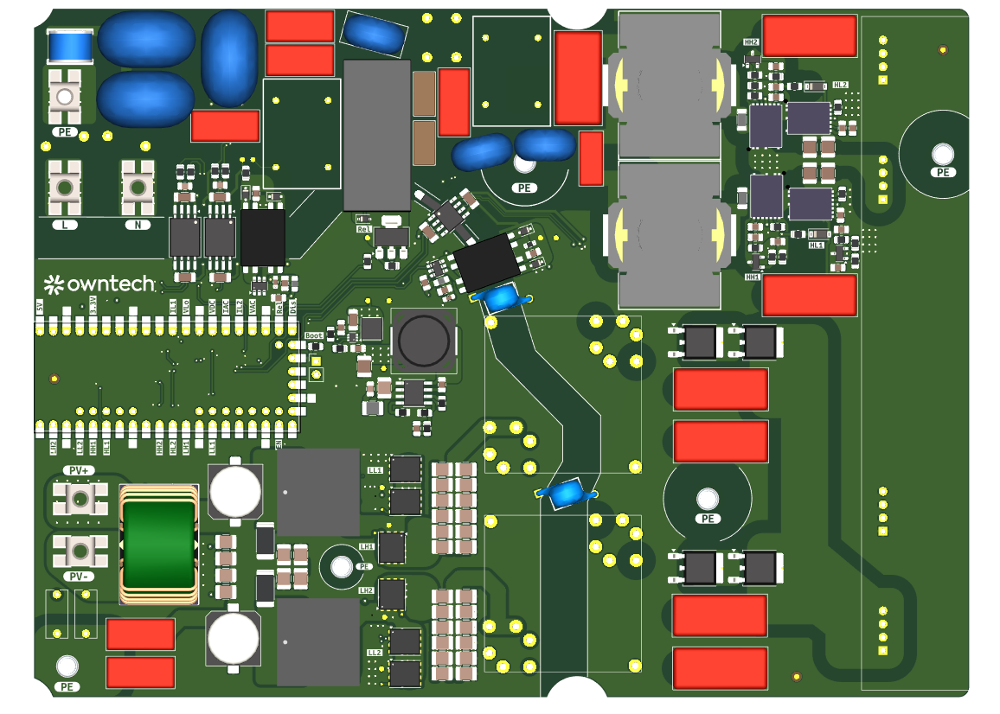
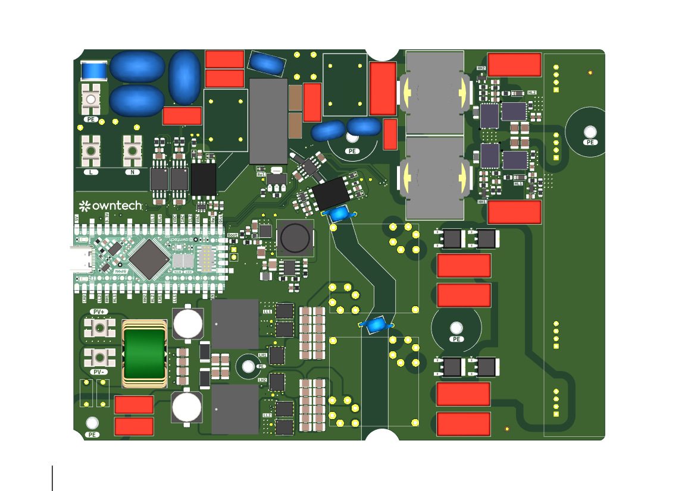
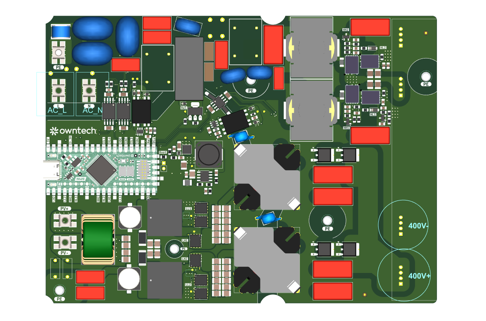
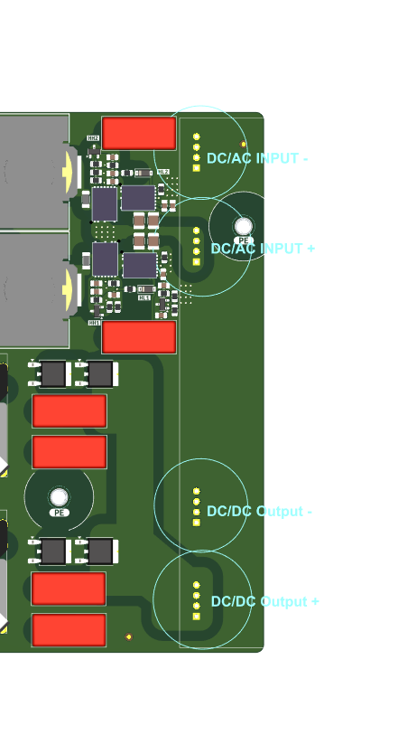
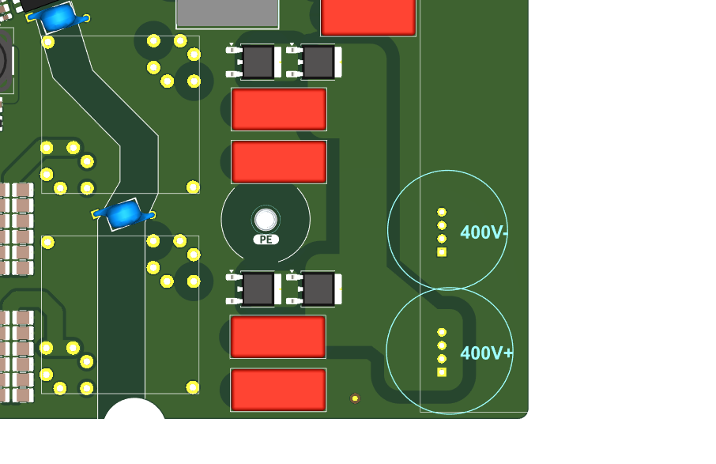
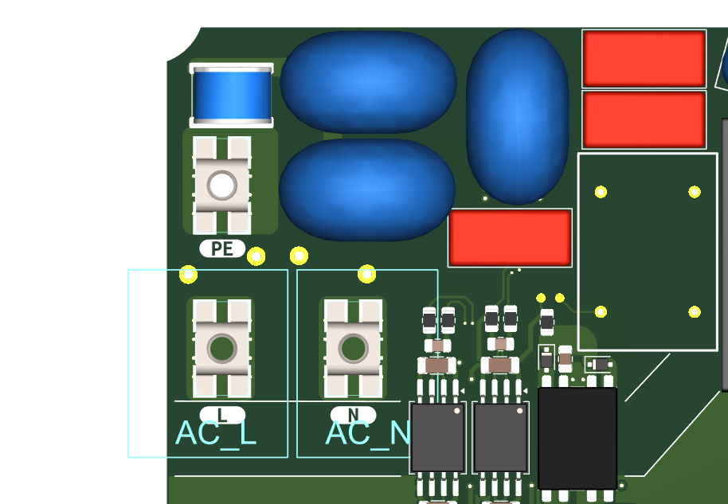
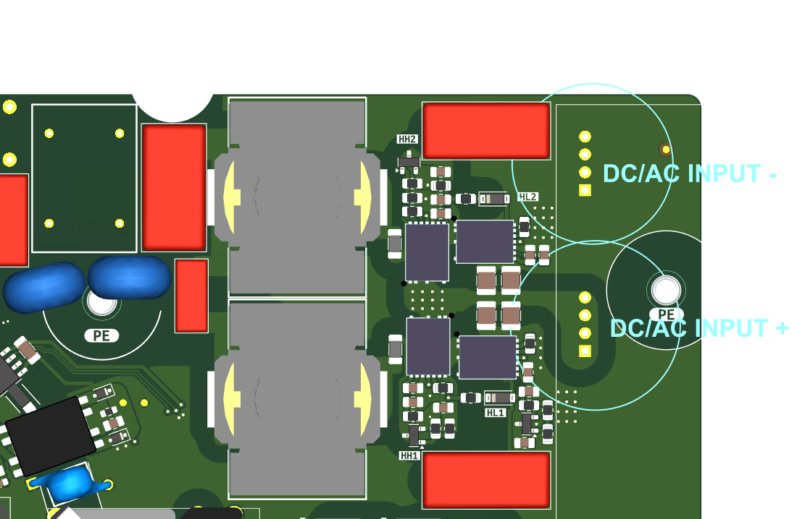
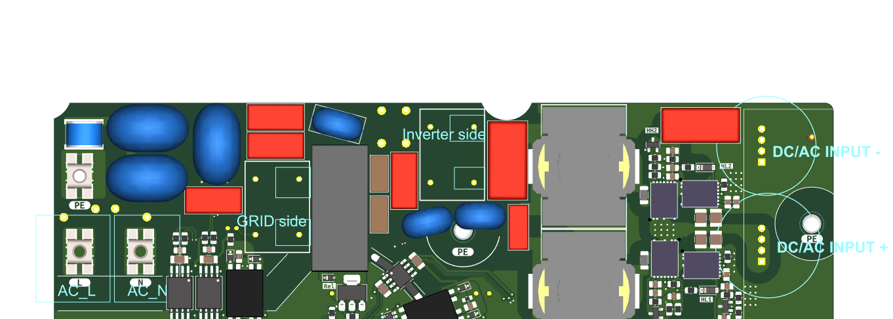
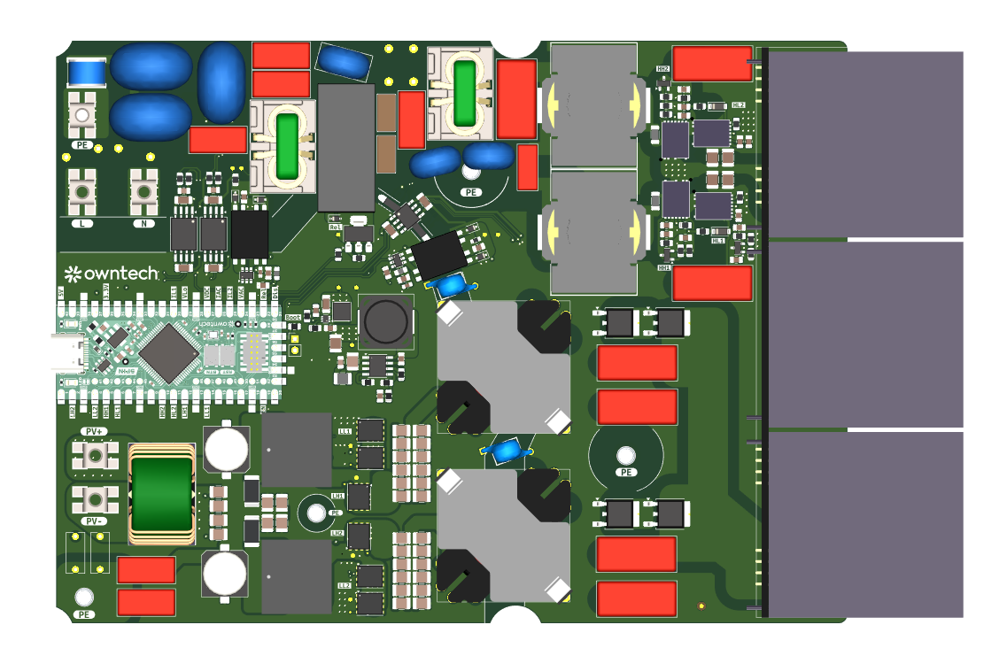

# Commisionning and test plan for the first prototypes. 

THIS DOCUMENT DESRIBES THE TEST PROCEDURE TO TEST A PROTOTYPE OF uVERTER. 

THIS IS INDENDED FOR TRAINED AND SKILLED POWER ELECTRONICS TECHNICIANS. DO NOT ATTEMPT WITHOUT PROPER SKILLS, PPE AND ASSISTANCE.  

DO NOT PROCEED ALONE WITH THIS TEST PROCEDURE.

## State of the bare board before final assembly of sub-pcbs and non COTS parts

**SECURE THE BOARD MECHANICALLY ON AN ISOLATED WORKBENCH BEFORE STARTING**

### Step 0 Check for worst case scenario  

With a multimeter in omhmeter mode 

- Check that 12V to ground and 5V to ground are not shorted. 
- Check that PV+ and PV- are not shorted
- Check that L and N are not shorted
- Check that PE and L and N and PV+ and PV- are not shorted

## Step 1 Low side feeder characterization

**Make sure you have a thermal camera**

Place a voltage source between PV+ and PV- 

**CHECK FOR HOTSPOTS**

- Check that 12V_LV supply rail works
- Check that 5V_DGND supply rail works
- Check that 12V_HV supply rail works
- Check that 5V_ACsense supply rail works
- Check that 5V_HV supply rail works
- Check that 5V_SN1 supply rail works
- Check that 5V_SN2 supply rail works
- Check that Vref supply 1.024V

*There might be an issue with capacitor loading of TL431 that might place the regulator in unstable region. In that case, we will need to swap output capacitance to either lower or higher value.* 

- Check it works for any voltage from 10V to 70V

**Retrieve datapoints and publish a plot with Vout against Vin**

- Add a resistive load to 12V rail, and check at which power rating it collapse. Do that for multiple VIN from 10V to 70V

**Define admissible voltage drop for the 12V rail**

**Retrieve datapoints and publish a plot with Pout_max against Vin**

**Retrieve datapoints and publish a plot with Efficiency against Vin**

- Add a resistive load to 5V rail, and check at which power rating it collapse. Do that for multiple VIN from 10V to 70V

**Define admissible voltage drop for the 5V rail**

**Retrieve datapoints and publish a plot with Pout_max against Vin**

**Retrieve datapoints and publish a plot with Efficiency against Vin**

## Step 2 check measurements at idle state    

- Check that DC voltage input sensor value is 1V for a DC voltage input of 40V. 

- Check that I_Ilow1 sensor value is about 0V (under no input currents conditions)

- Check that I_Ilow2 sensor value is about 0V (under no input currents conditions)

- Check that V_DcHigh sensor value is about 0V (no voltage on the 400V bus at this point)

- Check that VAc sensor value is about 1V (no voltage on the AC bus at this point so sensor centered at 1V.)

- Check that I_Ac sensor value is about 1V (no current on the AC bus at this point so sensor centered at 1V)

## Step 3 Assemble SPIN board and test relay

- Flash firmware  
- Verify that by default relay is **OPEN (NOT connected)**
- Verify that the spin board is able to close and open the contact. 

## Step 4 check pwm signals at the switch level.

**The following test is dangerous!! Make sure you do unsertand fully what you are doing. DO not perform this step alone**  

- Use test points provided for low side switch and verify that the switches operates correctly. (Mind the fact that they are not all on the same voltage reference when testing)

- Check the capacitor voltage to verify the boost effect of the T-Type halfbridge topology. (Mind the fact that they are not all on the same voltage reference when testing) **BE CAREFUL, IT IS A BOOST** If your PWM signals are to high the boost ratio can be really high without load!!!

- Test that the PWM signals are correctly present after the isolator for the DC/AC topology. 

- Check that the polarity of the PWM is the same before and after the isolator. (Mind the fact that they are not all on the same voltage reference when testing)

### Check the gain and offsets for the measurements  

  

- Isolate the last resistance from the DC sensor to connect it to the output of the DC/DC stage. 

This way, the DCDC stage is fully disconnected from the DC/AC stage and you can test the DC/DC stage with more peace of mind. 

- Check that there is no more continuity between DC/AC input and DC/DC output. 

  

**The following test is dangerous!! Make sure you do unsertand fully what you are doing. DO not perform this step alone**  

- Inject 400V on the capacitor bank on as shown below
- Make sure the microcontroller reads 400V on the VDc bus sensor

**The following test is dangerous!! Make sure you do unsertand fully what you are doing. DO not perform this step alone**  

- Inject 230V 50hz as shown below 
- Make sure the microcontroller reads 230VRms, and 50hz on the VDc bus sensor.
- Check the PLL behavior. 

**NOW DISCONNECT THE 230V. WE DO NOT NEED IT TO TEST DC/DC STAGE**

### Step 3 Assemble the two HF transformers  

- **DO add a serie wire between primary side and mosfets to place an oscilloscope Current probe**  
- This is important to test ZVS functionality. 

**The following test is dangerous!! Make sure you do unsertand fully what you are doing. DO not perform this step alone**  

**Make sure you have a thermal camera when doing first tests**

- Add a 250W rheostat rated for 230V between 400V- et 400V+ (electronics load does disturb efficiency test)

 

- Run the DCDC test code. That is the code with the open loop boost, and variable dead-time.
- Increase slowly the duty-cycle up to get 400V on the output. 
- Verify it stabilize the output voltage at 400V
- Follow the test procedure to verify we operate under ZVS 

**Retrieve datapoints and publish a plot with P_ZVS against Vin**

**Retrieve datapoints and publish a plot with efficiency against Vin**

- When characterization properly done, and data properly saved, remove the wire and install the transformer completely. 

## Step 4 DC/AC testing   

**The following test is dangerous!! Make sure you do unsertand fully what you are doing. DO not perform this step alone**  

 

- Inject 400V using preferably a lab bench supply with current limiting capabilities.

- Inject 230V using preferably an isolation transformer

- Check PLL once again 
- Make sure the relay stay **OPEN (NOT connected)**
- Start the inverter **Make sure to look the layout with a thermal camera**
- Measure the generated sinewave 
- Check synchronization between Grid side and output of the inverter (Inverter side). They should be perfectly in SYNC. (Think twice how to do the measurment with isolated probes)

  

## Step 5 Mount capacitors, and common-mode choke  

  

- Mount Common-mode choke and PP capacitors. 
- You now should be ready for integration test. 
